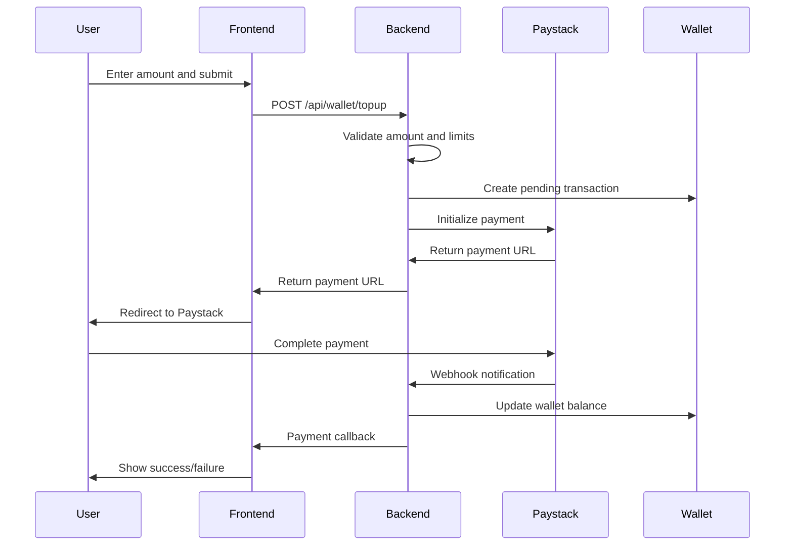

# Top-Up Implementation Guide

## Overview

This document outlines the complete implementation of the top-up functionality that allows users to add money to their accounts using Paystack payment gateway. The implementation integrates seamlessly with the existing wallet system and provides a secure, user-friendly experience.

## Features Implemented

### 1. Backend API Endpoints

#### `/api/wallet/topup` (POST)
- **Purpose**: Initialize a top-up transaction with Paystack
- **Authentication**: Required (Bearer token)
- **Request Body**:
  ```json
  {
    "amount": 50,
    "email": "user@example.com",
    "phoneNumber": "0241234567", // Optional
    "metadata": {
      "source": "web_topup"
    }
  }
  ```
- **Response**:
  ```json
  {
    "success": true,
    "message": "Top-up initiated successfully",
    "data": {
      "reference": "TOPUP-1234567890-abc123",
      "amount": 50,
      "paystackUrl": "https://checkout.paystack.com/...",
      "accessCode": "access_code_123"
    },
    "limits": {
      "dailyRemaining": 9950,
      "monthlyRemaining": 49950,
      "maxBalanceRemaining": 99950
    }
  }
  ```

#### `/api/wallet/topup/verify/:reference` (GET)
- **Purpose**: Verify the status of a top-up transaction
- **Authentication**: Required (Bearer token)
- **Response**:
  ```json
  {
    "success": true,
    "message": "Top-up completed successfully",
    "data": {
      "reference": "TOPUP-1234567890-abc123",
      "amount": 50,
      "status": "completed",
      "newBalance": 150,
      "completedAt": "2024-01-15T10:30:00Z"
    }
  }
  ```

### 2. Frontend Components

#### Top-Up Page (`/topup`)
- **Location**: `Client/app/topup/page.js`
- **Features**:
  - Amount selection with quick options (₵10, ₵20, ₵50, ₵100, ₵200, ₵500)
  - Custom amount input
  - Real-time fee calculation (3% processing fee)
  - Account status validation
  - Rate limiting and circuit breaker protection
  - Responsive design with modern UI

#### Payment Callback Page (`/payment/callback`)
- **Location**: `Client/app/payment/callback/page.js`
- **Features**:
  - Automatic payment verification
  - Success/failure status display
  - Transaction details summary
  - Automatic redirect to wallet page
  - Retry functionality for failed verifications

#### Wallet Page (`/wallet`)
- **Location**: `Client/app/wallet/page.js`
- **Features**:
  - Current balance display with hide/show toggle
  - Recent transaction history
  - Wallet statistics (total deposits, total spent)
  - Quick top-up button
  - Transaction status indicators

### 3. Security Features

#### Validation & Limits
- **Minimum Amount**: ₵10
- **Maximum Amount**: ₵100,000 per transaction
- **Daily Limit**: ₵10,000 (configurable)
- **Monthly Limit**: ₵50,000 (configurable)
- **Maximum Balance**: ₵100,000 (configurable)

#### Account Status Checks
- Account disabled status
- Account approval status (pending/rejected)
- Wallet frozen status
- User authentication validation

#### Rate Limiting
- Circuit breaker pattern for repeated failures
- Request debouncing (30 seconds between requests)
- Maximum 3 requests per minute
- Automatic recovery mechanisms

### 4. Integration Points

#### Wallet Service Integration
- Uses existing `WalletService` for balance updates
- Automatic cache invalidation
- Transaction logging and tracking
- Consistent balance management

#### Paystack Integration
- Live API integration with proper error handling
- Webhook support for payment notifications
- Transaction verification with Paystack API
- Support for multiple payment channels (card, bank, mobile money)

#### Database Integration
- Transaction records in wallet collection
- User balance updates
- Comprehensive transaction history
- Metadata storage for audit trails

## Technical Implementation Details

### 1. Transaction Flow



### 2. Error Handling

#### Client-Side Errors
- Network connectivity issues
- Authentication failures
- Rate limiting responses
- Validation errors
- Payment gateway errors

#### Server-Side Errors
- Database connection issues
- Paystack API failures
- Transaction processing errors
- Wallet service failures

### 3. Caching Strategy

#### Wallet Balance Caching
- In-memory cache for frequently accessed balances
- Automatic cache invalidation on balance updates
- Cache warming for active users
- Cache statistics and monitoring

#### Transaction Caching
- Completed transaction caching
- Duplicate transaction prevention
- Performance optimization for high-traffic scenarios

## Testing

### Test Script
Run the comprehensive test suite:
```bash
node test-topup-integration.js
```

### Test Coverage
- ✅ Top-up initialization
- ✅ Payment verification
- ✅ Wallet balance updates
- ✅ Transaction history
- ✅ Validation rules
- ✅ Error handling
- ✅ Rate limiting
- ✅ Account status checks

## Deployment Considerations

### Environment Variables
```env
PAYSTACK_SECRET_KEY=sk_live_...
FRONTEND_URL=https://www.unlimiteddatagh.com
NODE_ENV=production
```

### Database Requirements
- MongoDB with wallet collection
- Transaction indexing for performance
- User collection with balance fields

### Monitoring
- Transaction success/failure rates
- Payment gateway response times
- Wallet balance accuracy
- User experience metrics

## Usage Instructions

### For Users
1. Navigate to `/topup` page
2. Select or enter desired amount
3. Click "Pay with Paystack"
4. Complete payment on Paystack
5. Return to wallet to see updated balance

### For Developers
1. Ensure all environment variables are set
2. Run the test script to verify integration
3. Monitor logs for any issues
4. Check wallet balance accuracy regularly

## Troubleshooting

### Common Issues

#### Payment Not Reflecting
- Check Paystack webhook configuration
- Verify transaction status in database
- Check wallet service logs
- Ensure cache invalidation is working

#### Rate Limiting Issues
- Check request frequency
- Verify circuit breaker status
- Review rate limiting configuration
- Check for duplicate requests

#### Validation Errors
- Verify amount limits
- Check account status
- Ensure user authentication
- Review transaction limits

## Future Enhancements

### Planned Features
- Recurring top-up subscriptions
- Bulk top-up options
- Promo code integration
- Multi-currency support
- Advanced analytics dashboard

### Performance Optimizations
- Database query optimization
- Enhanced caching strategies
- CDN integration for static assets
- Load balancing for high traffic

## Support

For technical support or questions about the top-up implementation:
- Email: support@unlimiteddata-gh.com
- Documentation: This guide and inline code comments
- Test Script: `test-topup-integration.js`

---

**Last Updated**: January 2024
**Version**: 1.0.0
**Status**: Production Ready
